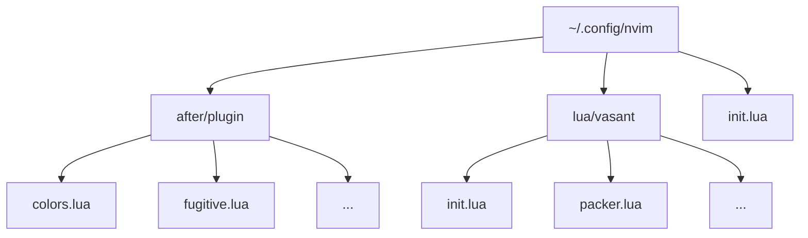

<div align="center">

# 🚀 Cosmic Neovim

[](https://lua.org)
[](https://neovim.io)
[](LICENSE)


*A supercharged ⚡ Neovim configuration for the modern developer*

[Key Features](#-key-features) •
[Quick Start](#-quick-start) •
[Keybindings](#-keybindings) •
[Customization](#-customization)

</div>

---

## ✨ Key Features

<details>
<summary>🎨 Beautiful UI & Theme</summary>

- **Rose Pine Theme** with transparent background support
- **Custom statusline** with git integration
- **Smooth scrolling** and animations
- **Modern tabline** with buffer indicators
- **Icons** for a better visual experience
</details>

<details>
<summary>🛠️ Development Tools</summary>

- **LSP Integration** with auto-completion
- **Syntax Highlighting** via Treesitter
- **Git Integration** through Fugitive
- **Fuzzy Finding** with Telescope
- **File Navigation** using Harpoon
</details>

<details>
<summary>🧩 Smart Features</summary>

- **Auto-pairs** for brackets and quotes
- **Smart indentation**
- **Code folding**
- **Multi-cursor** support
- **Snippet** integration
</details>

## 🚀 Quick Start

### Prerequisites

> [!IMPORTANT]
> Make sure you have these installed before proceeding:

```bash
# Install prerequisites (Ubuntu/Debian)
sudo apt install neovim git nodejs ripgrep
```

<details>
<summary>📦 Other Operating Systems</summary>

#### macOS
```bash
brew install neovim git node ripgrep
```

#### Arch Linux
```bash
sudo pacman -S neovim git nodejs ripgrep
```
</details>

### 🔥 One-Line Installation

```bash
curl -sSL https://raw.githubusercontent.com/yourusername/nvim-config/main/install.sh | bash
```

<details>
<summary>🔧 Manual Installation</summary>

1. **Backup** existing config:
```bash
mv ~/.config/nvim ~/.config/nvim.backup
```

2. **Clone** this configuration:
```bash
git clone https://github.com/yourusername/nvim-config.git ~/.config/nvim
```

3. **Install** Packer:
```bash
git clone --depth 1 https://github.com/wbthomason/packer.nvim\
 ~/.local/share/nvim/site/pack/packer/start/packer.nvim
```

4. **Sync** plugins:
```vim
:PackerSync
```
</details>

## 🗂️ Project Structure



## ⌨️ Keybindings

> [!TIP]
> Press `space + ?` in normal mode to open the interactive keybinding cheatsheet!

<details>
<summary>🌟 Essential Bindings</summary>

### General
| Key | Action | Mode |
|-----|--------|------|
| `<Space>` | Leader key | Normal |
| `<leader>pv` | File explorer | Normal |
| `<leader>s` | Search & replace | Normal |

### Navigation
| Key | Action | Mode |
|-----|--------|------|
| `<C-p>` | Fuzzy find files | Normal |
| `<C-f>` | Find in files | Normal |
| `<C-e>` | Recent files | Normal |

</details>

<details>
<summary>🔍 Telescope</summary>

### Fuzzy Finding
| Key | Action |
|-----|--------|
| `<leader>ff` | Find files |
| `<leader>fg` | Live grep |
| `<leader>fb` | Buffers |
| `<leader>fh` | Help tags |

</details>

<details>
<summary>📝 LSP</summary>

### Code Navigation
| Key | Action |
|-----|--------|
| `gd` | Go to definition |
| `K` | Hover doc |
| `<leader>ca` | Code actions |
| `<leader>rn` | Rename |

</details>

## 🎨 Customization

> [!NOTE]
> All configuration files are well-documented and easy to customize!

<details>
<summary>🌈 Theme Customization</summary>

Edit `after/plugin/colors.lua`:
```lua
require('rose-pine').setup({
    variant = 'moon',
    dark_variant = 'main',
    bold_vert_split = false,
    dim_nc_background = false,
    disable_background = true,
    disable_float_background = false,
    disable_italics = false,
})
```
</details>

<details>
<summary>🔧 LSP Configuration</summary>

Add new language servers in `after/plugin/lsp.lua`:
```lua
local servers = {
    'lua_ls',
    'tsserver',
    'rust_analyzer',
    -- Add your servers here
}
```
</details>

## 📦 Plugin List

<details>
<summary>Core Plugins</summary>

- **🔌 [packer.nvim](https://github.com/wbthomason/packer.nvim)** - Plugin manager
- **🔍 [telescope.nvim](https://github.com/nvim-telescope/telescope.nvim)** - Fuzzy finder
- **🎨 [rose-pine](https://github.com/rose-pine/neovim)** - Theme
- **🌳 [nvim-treesitter](https://github.com/nvim-treesitter/nvim-treesitter)** - Syntax
</details>

<details>
<summary>Development</summary>

- **📝 [nvim-lspconfig](https://github.com/neovim/nvim-lspconfig)** - LSP
- **💡 [nvim-cmp](https://github.com/hrsh7th/nvim-cmp)** - Completion
- **📂 [harpoon](https://github.com/ThePrimeagen/harpoon)** - File navigation
- **🔄 [vim-fugitive](https://github.com/tpope/vim-fugitive)** - Git
</details>

## 🌟 Language Support

> [!TIP]
> Use `:Mason` to install additional language servers!

<details>
<summary>Supported Languages</summary>

- **🟦 TypeScript/JavaScript**
- **🦀 Rust**
- **🐍 Python**
- **💎 Ruby**
- **☕ Java**
- **🎯 Dart**
- **⚛️ React**
- **🟩 Vue**
- **🟨 Golang**
</details>

## 🤝 Contributing

> [!IMPORTANT]
> Contributions are what make the open-source community amazing! 

1. Fork the Project
2. Create your Feature Branch (`git checkout -b feature/AmazingFeature`)
3. Commit your Changes (`git commit -m 'Add some AmazingFeature'`)
4. Push to the Branch (`git push origin feature/AmazingFeature`)
5. Open a Pull Request

## 📜 License

This project is licensed under the MIT License - see the [LICENSE](LICENSE) file for details.

<div align="center">

---

### 🌟 Star this repo if you like it!

[Report Bug](https://github.com/yourusername/nvim-config/issues) • 
[Request Feature](https://github.com/yourusername/nvim-config/issues) •
[Join Community](https://discord.gg/yourdiscord)

</div>